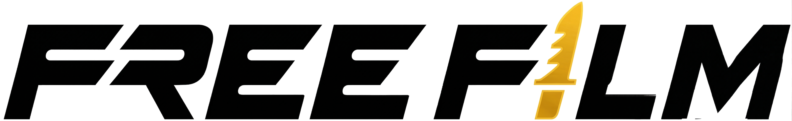

# 🎬 FreeFilm - Cinematic Movie UI

**FreeFilm** là một dự án giao diện web xem phim trực tuyến mã nguồn mở. Dự án tập trung vào trải nghiệm người dùng (UX/UI) với phong cách thiết kế hiện đại **Glassmorphism**, mang lại cảm giác "Cinematic" sang trọng và tối ưu hóa tuyệt đối cho thiết bị di động. Nguồn phim luôn được tự động cập nhật liên tục các bộ phim mới nhất, phim bộ, phim lẻ, hoạt hình và TV shows.

🌍 **Live Demo:** [https://freefilm.pp.ua](https://freefilm.pp.ua)

## ✨ Tính năng nổi bật

* **Phim mới mỗi ngày:** Hệ thống tự động cập nhật liên tục các bộ phim, tập phim mới nhất ngay khi ra mắt.
* **Giao diện Glassmorphism:** Hiệu ứng kính mờ, đổ bóng và màu sắc UI hiện đại, mang lại không gian điện ảnh thực thụ.
* **Responsive 100%:** Hiển thị hoàn hảo trên mọi thiết bị (PC, Tablet, Mobile). Đặc biệt tối ưu các nút bấm và lưới phim cho màn hình điện thoại.
* **Tìm kiếm & Bộ lọc thông minh:** Tìm kiếm phim theo từ khóa, lọc theo 22+ thể loại khác nhau.
* **Trình phát video nâng cao:**
    * Hỗ trợ chọn nhiều Server dự phòng và danh sách Tập phim trực quan.
    * Xem Popup Trailer mượt mà ngay trên trang.
    * Tự động lưu lịch sử tập phim đang xem (Local Storage).
    * Hiển thị điểm đánh giá và thông tin chi tiết (Đạo diễn, Diễn viên, Thời lượng...).

## 🛠 Công nghệ sử dụng

Dự án được xây dựng thuần túy, không phụ thuộc vào framework hay thư viện nặng nề nhằm tối ưu tốc độ tải trang:
* **HTML5** (Cấu trúc Semantic)
* **CSS3** (Flexbox, CSS Grid, Media Queries, Custom Properties)
* **Vanilla JavaScript** (ES6+, Async/Await, DOM Manipulation)

## 📝 Tác giả
* **Phan Văn Đức** - *Frontend Developer & UI Designer*
